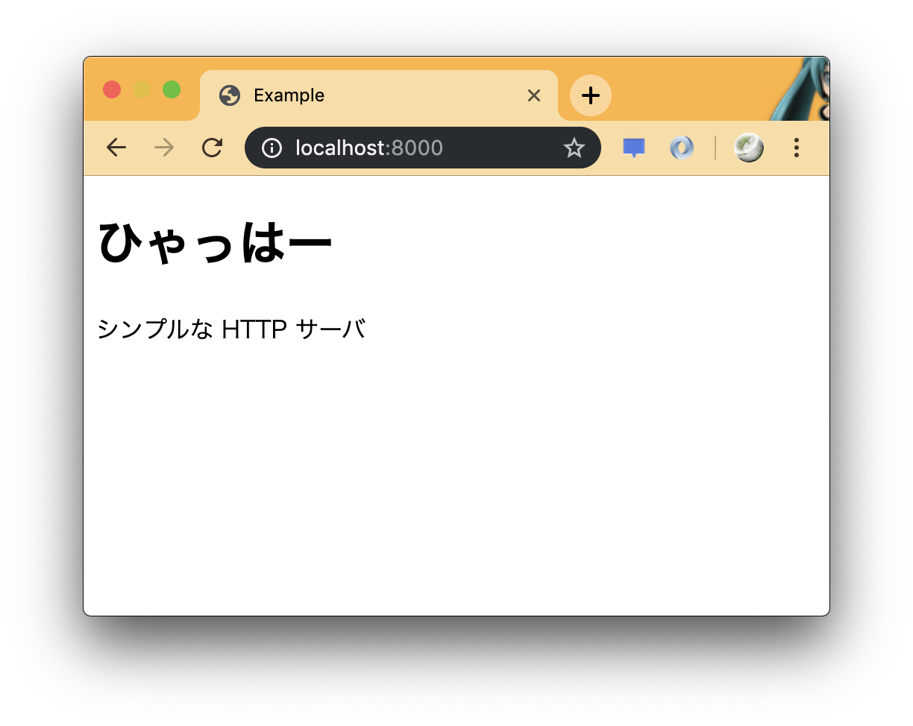

# 瞬間 HTTP サーバ

for Python 3.7.x

## HTTP サーバを単独起動

Python には HTTP サーバがデフォルトで樽座しています。

```bash
$ cd example
$ python -m http.server 8000
Serving HTTP on 0.0.0.0 port 8000 (http://0.0.0.0:8000/)
```

後は Chrome でアクセスしてみます。



死ぬほど簡単でしょう？

## プログラムで実行

プログラムからも指定して起動することもできます。

```python
import http.server
import socketserver

PORT = 8000
Handler = http.server.SimpleHTTPRequestHandler

with socketserver.TCPServer(("", PORT), Handler) as httpd:
    print("Start server at: ", PORT)
    httpd.serve_forever()
```

