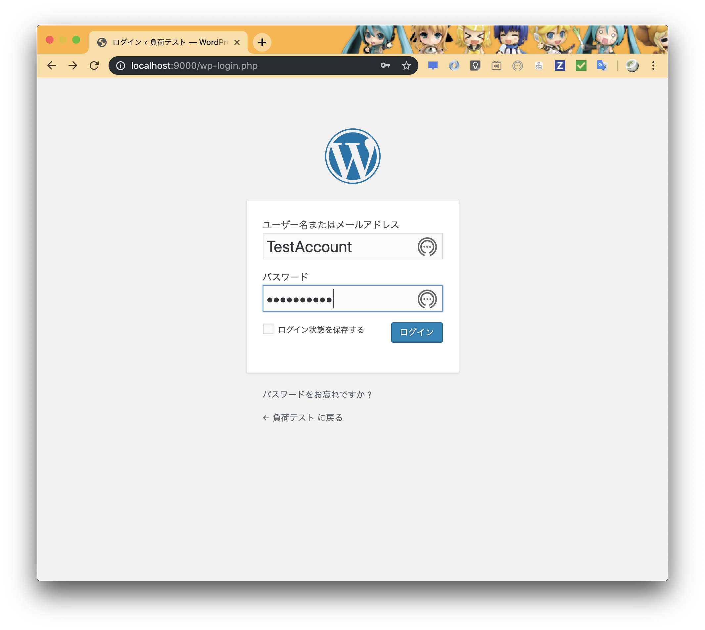

# 負荷テストを簡単に

for Python 3.7.x

## テスト対象のサーバを起動する

require: Docker version 19.03.+

今回はテスト対象サーバとして、Wordpress を用意しました。  
対象の設定はこのディレクトリにある docker-compose.yml で、次のコマンドで起動します。

```sh
$ docker-compose up --detach
```

`http://localhost:9000` にアクセスすると、Wordpress のセットアップが見れるはずです。  
適当にセットアップしてしまいましょう。

    ID/Password はこのとき控えておいてください。


ついでにログインできることも確認しましょう。




## LOCUST インストール

Python 用の負荷テストツールをインストールします。  
これもライブラリとして配布されてますので、pip からインストールできます。

```sh
$ sudo pip install locustio
```

このツールはインストール時にコマンドも入るので、確認してみます。

```sh
$  locust --version
[2019-10-02 21:12:48,992] anyone-macbookpro.local/INFO/stdout: Locust 0.11.0
[2019-10-02 21:12:48,992] anyone-macbookpro.local/INFO/stdout: 
```

## 負荷テストスクリプト作成

作成中に Wordpress のフォームや通信見て愕然…CSRF対策してなくね？（汗  
デフォルトでセキュリティ設定してないせいだろうか…

とりあえずこの Docker イメージをデプロイとかないわー

作成するソースはこんな感じ。  
ファイル名は `locustfile.py` という名前にしておきます。

```python
from locust import HttpLocust, TaskSet, task

import re


class UserBehavior(TaskSet):
    def on_start(self):
        self.login()

    def on_stop(self):
        self.logout()

    def login(self):
        # Cookie などを受け取る目的で
        self.client.get("/wp-login.php")
        parameters = {
            'log': 'TestAccount',
            'pwd': 'Fire!!1192',
            'redirect_to': 'http://localhost:9000/wp-admin/',
            'testcookie': '1'
        }

        self.client.post("/wp-login.php", parameters)

    def logout(self):
        response = self.client.get("/wp-admin/")
        # ログアウト用 URL 取得
        logout_url = re.search(
            r'<a class="screen-reader-shortcut" href="http:\/\/localhost\:9000(.+)">ログアウト</a>',
            response.text).group(1)
        self.client.get(logout_url)

    @task
    def top(self):
        self.client.get("/")

    @task(2)
    def mypage(self):
        with self.client.get("/wp-admin/customize.php", catch_response=True) as response:
            if response.status_code != 200:
                response.failure("not authenticated???")

    @task
    def projects(self):
        self.client.get("/wp-admin/")


class Wordpress(HttpLocust):
    task_set = UserBehavior
    min_wait = 500
    max_wait = 1000
```

起動には `locust --host=http:9000` とします。  
また、このとき別のファイル名で保存している場合は、 `-f` オプションで指定します。

```bash
$ locust --host=http://localhost:9000
[2019-10-02 21:46:39,148] arstromeria-macbook-pro.local/INFO/locust.main: Starting web monitor at *:8089
[2019-10-02 21:46:39,149] arstromeria-macbook-pro.local/INFO/locust.main: Starting Locust 0.11.0
```

サーバが起動していますので、`http://localhost:8089` へアクセスしてみます。


見たまま「何人が」「１秒間に何人づつ増やしてアクセスするか」という画面ですね。  
適当に、秒間 2 人づつ、20 人がアクセスしてきたと想定して操作してみましょうか。

尚、止めるまでは延々アクセスし続け、リアルタイムに集計を行います。


### テスト終了

特に考えることはありません。コンソール上で `Ctrl+C` でインタラプトしてしまいましょう。

```bash
$ locust --host=http://localhost:9000
[2019-10-02 21:46:39,148] arstromeria-macbook-pro.local/INFO/locust.main: Starting web monitor at *:8089
[2019-10-02 21:46:39,149] arstromeria-macbook-pro.local/INFO/locust.main: Starting Locust 0.11.0
[2019-10-02 21:55:56,645] arstromeria-macbook-pro.local/INFO/locust.runners: Hatching and swarming 10 clients at the rate 2 clients/s...
[2019-10-02 21:56:01,675] arstromeria-macbook-pro.local/INFO/locust.runners: All locusts hatched: Wordpress: 10
[2019-10-02 21:58:52,011] arstromeria-macbook-pro.local/INFO/locust.runners: Hatching and swarming 20 clients at the rate 2 clients/s...
[2019-10-02 21:59:02,049] arstromeria-macbook-pro.local/INFO/locust.runners: All locusts hatched: Wordpress: 20
^C[2019-10-02 22:05:27,061] arstromeria-macbook-pro.local/ERROR/stderr: KeyboardInterrupt
[2019-10-02 22:05:27,061] arstromeria-macbook-pro.local/ERROR/stderr: 2019-10-02T13:05:27Z
[2019-10-02 22:05:27,061] arstromeria-macbook-pro.local/ERROR/stderr: 
[2019-10-02 22:05:27,061] arstromeria-macbook-pro.local/INFO/locust.main: Shutting down (exit code 0), bye.
[2019-10-02 22:05:27,062] arstromeria-macbook-pro.local/INFO/locust.main: Cleaning up runner...
[2019-10-02 22:05:27,062] arstromeria-macbook-pro.local/INFO/locust.main: Running teardowns...
 Name                                                          # reqs      # fails     Avg     Min     Max  |  Median   req/s
--------------------------------------------------------------------------------------------------------------------------------------------
 GET /                                                            411     0(0.00%)      42      27     126  |      39    4.50
 GET /wp-admin/                                                   412     0(0.00%)      74      44     405  |      60    6.00
 GET /wp-admin/customize.php                                      882     0(0.00%)      76      53     196  |      73   13.50
 GET /wp-login.php                                                 20     0(0.00%)      30      25      42  |      28    0.00
 POST /wp-login.php                                                20     0(0.00%)      93      78     124  |      90    0.00
 GET /wp-login.php?action=logout&                                  20   20(50.00%)      77      29     166  |      62    0.00
--------------------------------------------------------------------------------------------------------------------------------------------
 Total                                                           1765    20(1.13%)                                      24.00

Percentage of the requests completed within given times
 Name                                                           # reqs    50%    66%    75%    80%    90%    95%    98%    99%   100%
--------------------------------------------------------------------------------------------------------------------------------------------
 GET /                                                             411     39     42     44     46     53     59     67     79    130
 GET /wp-admin/                                                    412     60     65     69     72     86    120    320    370    410
 GET /wp-admin/customize.php                                       882     73     78     82     85     93    100    120    130    200
 GET /wp-login.php                                                  20     29     32     33     33     41     42     42     42     42
 POST /wp-login.php                                                 20     90     98    100    100    120    120    120    120    120
 GET /wp-login.php?action=logout&                                   20     76     90     93     99    140    170    170    170    170
--------------------------------------------------------------------------------------------------------------------------------------------
 Total                                                            1765     66     72     76     79     89    100    120    210    410

Error report
 # occurrences      Error                                                                                               
--------------------------------------------------------------------------------------------------------------------------------------------
 1                  GET /wp-login.php?action=logout&: "HTTPError('403 Client Error: Forbidden for url: http://localhost:9000/wp-login.php?action=logout&#038;_wpnonce=44f41a628e')"
 1                  GET /wp-login.php?action=logout&: "HTTPError('403 Client Error: Forbidden for url: http://localhost:9000/wp-login.php?action=logout&#038;_wpnonce=a105793727')"
 1                  GET /wp-login.php?action=logout&: "HTTPError('403 Client Error: Forbidden for url: 
 /* 中略 */
--------------------------------------------------------------------------------------------------------------------------------------------

```


### 注意: Docker は必ず止めておこう

黙ってると Wordpress サーバは立ったままになるので、必ず終了します。

```bash
$ docker container ls
CONTAINER ID        IMAGE               COMMAND                  CREATED             STATUS              PORTS                               NAMES
93507e1f73f6        wordpress:latest    "docker-entrypoint.s…"   About an hour ago   Up About an hour    0.0.0.0:9000->80/tcp                stress_test_wordpress_1
8e5b5f06fe34        mysql:5.7           "docker-entrypoint.s…"   About an hour ago   Up About an hour    0.0.0.0:3306->3306/tcp, 33060/tcp   stress_test_wordpress-db_1

$ docker container kill 93507e1f73f6
93507e1f73f6

$ docker container kill 8e5b5f06fe34
8e5b5f06fe34

$ docker container ls
CONTAINER ID        IMAGE               COMMAND             CREATED             STATUS              PORTS               NAMES
$ 
```