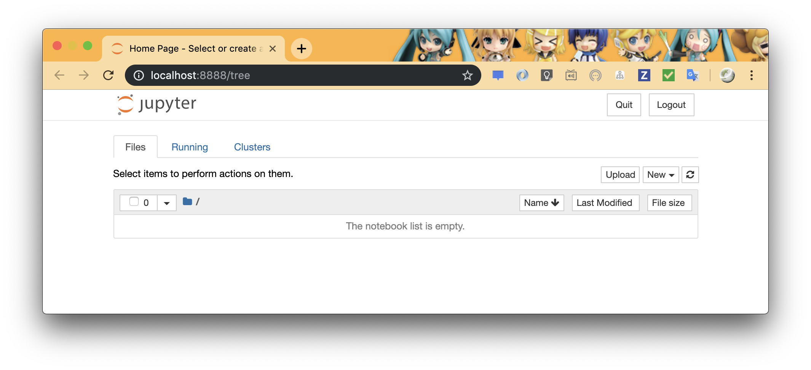
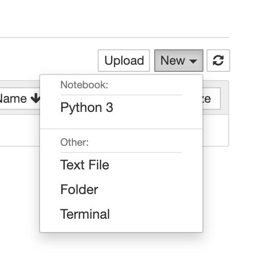
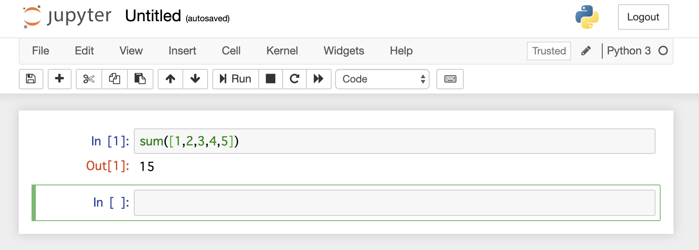
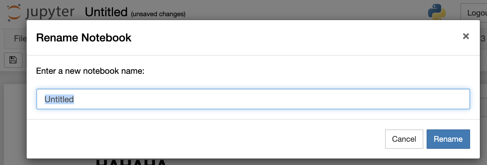
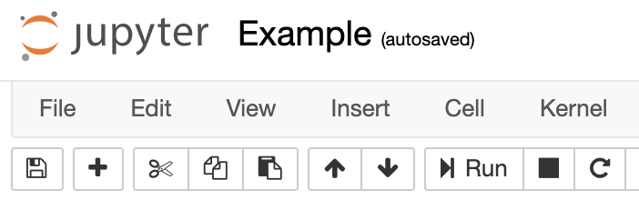
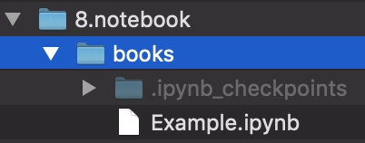
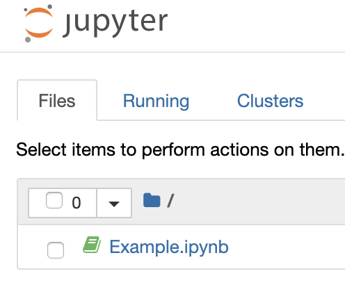
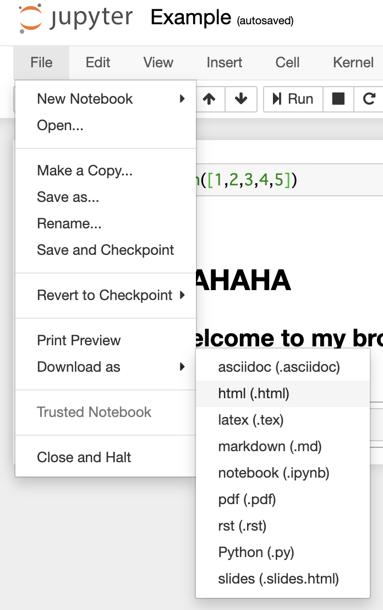

# Jupiter notebook

for Python 3.7.x

公式には https://jupyter.org/ を参照してください。  
これは一体どう言ったアプリかというと、

1. Webサーバ場で Python/R と言った言語を操作し、REPL 表示できる
2. Markdown などを選択的に挟むことで、動作説明文書としてそのまま活用できる

とか色々書きましたが、言い方を変えると「（文書内のコードが）実行可能なドキュメント環境」と言えると思います。

## Jupiter notebook インストール

Anaconda を利用してインストールした人は、この手順は必要ありません。  
Python3.x がインストールされている場合、以下のコマンドでインストールが可能です。

```bash
$ pip install --upgrade pip
$ pip install jupyter
```

## Jupiter notebook 起動

これ自体はコマンドを実行するだけです。  
このリポジトリを clone している場合は、`notebook/notebook_with_data/notebooks` にカレントを移動し、次のコマンドを実行します。

```sh
$ jupyter notebook
```

すぐにブラウザが起動し、次の様な画面が表示されているはずです。



## notebook の基本

新規のノートを開始してみます。  
画面右上の「New」から作成する Book を起動します。



書いてあるものが Web 上で操作できるあれこれです。  
ここでは、Python 3 を起動してみます。



入力項目にはそのまま Python のコードが記述でき、Windows なら `Ctrl + Enter` Mac なら `Opt + Enter` で実行し、次の入力項目に繋げることができます。  
上のアイコン項目は割とみたままですし悩むことはないかなと。

Code の項目を選択すると Markdown などを選択することができます。


実行するとこんな感じの表示に変換されます。


## 保存

保存する前にノートに名前をつけてみましょうか。  
タイトルをクリックすれば、変更可能です。



`Rename` で変更



まず、単純な保存はディスクのアイコンからいけます。


保存に成功すると、ノート作成ディレクトリにファイルが出来上がります。



読み込みは notebook 起動時に選択すれば開くことができます。



## エクスポート

ファイルをいくつかの手段で保存することができます。  
`File` の `Download as` からい色選択することができます。



