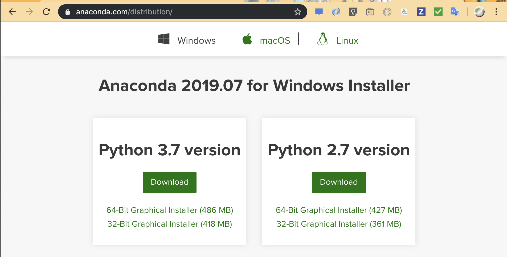

<!-- $theme: gaia -->

# Python と機械学習の入門

## つつじー

---
<!-- page_number: true -->

### 誰？

* 吉井温(すなお) H N: つつじー
* 普段の仕事: 株Kitalive  
  (Salesforce系コンサル/開発)
* ブログ: 技術をかじる猫
* Tritter: @white_azalea

空気が読めない技術好き。  
Scala とか F# とか関数型が割と好きで、変数書き換えにアレルギーが出ます。

---

### 最初に

##### この内容は以下のリポジトリに全部あります。
###### https://github.com/Sunao-Yoshii/WelcomePythonExamples

---

### 今日のゴール

1. Python がどんな言語か何となく判ってもらえる。
2. どんな事がとりあえず直ぐできるのか判ってもらえる。
3. 業務の補佐に利用するには十分なポテンシャルがありそうだと認識してもらえる。
4. 機械学習始める人のとっかかりになる。

---

### お品書き

1. 第二言語としてのPython
1.1. Pythonを第二言語に選ぶ理由
1.2. Python入門
1.3. ファイル操作
1.4. シェルとの共存
1.5. Webのテストツールとしての運用
2. データサイエンスと機械学習へ
2.1. jupyter notebook
2.2. 数学計算
2.3. グラフ化とデータ加工
2.4. 機械学習
2.5. データサイエンスを始める

---

### 第一章.第二言語としてのPython

---

### Pythonを第二言語に選ぶ理由

1. スクリプト言語である  
   書いて直ぐ試せるから書き捨てに最適です。
2. シンプルで読みやすい  
   「一つの目的には一つの書き方を」という哲学のある言語です。誰が書いてもコードは同じ。保守にも改造にも最適でしょう？
3. ライブラリが強力で使いやすい  
   Python のライブラリは多種多様でしかも強力です。しかも、**いつでも使い方を参照できます** 。

これらを実際にみてみましょう。

---

### Python入門

簡単に使い方を説明していきます。

これから説明する内容は全て [Anaconda](https://www.anaconda.com/distribution/) をインストールしておけば大体行うことができます。

<center>

</center>

ともあれインストール自体はインストーラーに Yes で答えるだけですので飛ばします。

---

### Python入門

#### 実際に操作して動作を説明します。
#### (お品書きは次ページ)

---

### Python入門

1. REPL (Read Eval Print Loop) の起動
2. 変数と四則演算(今更データ型とか要らんでしょ？)
3. コレクションとリスト操作(len,min,max,sum,zip)
4. 統計機能(mean,median,variance,stdev,statistics)
5. 正規表現
6. 制御文
7. オブジェクト指向
8. スクリプトファイルへの出力

---

### ファイル操作

当たり前ですがテキストファイルの操作ができます。

```python
with open('file.txt', mode='w', encoding='utf-8') as wf:
    wf.write('Hello ミスター。\n調子はどうだ？')
```

そして読み込みを行う事もできます。  
これだけできればログ解析と簡単な統計処理ができますね。

```python
with open('file.txt', mode='r', encoding='utf-8') as rf:
    print(rf.readlines())
```

---

### ファイル操作

CSV 操作もふぉい

```python
import csv
with open('data.csv', mode='w', encoding='utf-8') as wf:
    outdata = [
        ['Id', 'Name', 'Cost'],
        ['01', '白き鋼鉄のX', '3818'],
        ['02', 'Ori and the Blind Forest', '1900']
    ]
    writer = csv.writer(wf)
    writer.writerows(outdata)
```

```python
import csv
with open('data.csv', mode='r', encoding='utf-8') as rf:
    readlines = csv.reader(rf)
    print(list(readlines))
```

---

### ファイル操作

Excel の操作も `openpyxl` をインストールして。

```python
import openpyxl as px
book = px.Workbook()
sheet = book.active
sheet['A1'] = 'Welcome to my broken show!'
book.save("sample.xlsx")
```

```python
import openpyxl as px
book = px.load_workbook('sample.xlsx')
print(book.sheetnames)
sheet = book['Sheet']
print(sheet['A1'].value)
```

---

### ファイル操作

操作系標準ライブラリから

```python
import os, shutil, glob
```

```python
os.path.exists('./README.md')  # 存在確認
os.path.isfile('./README.md')  # ファイル判定
os.path.isdir('README.md')  # ディレクトリ判定
os.mkdir('./new_dir')  # ディレクトリ作成
os.remove("./NEW_README.md")  # ファイル削除
os.rmdir("./dummyDir") # ディレクトリ削除
shutil.rmtree("./copy2")  # ファイルごとディレクトリ削除
shutil.copy('./README.md', './NEW_README.md') # コピー
shutil.copytree("./tutorial", "./copy2") # ディレクトリコピー
```

まだまだいくよー

---

### ファイル操作

```python
# ファイル移動
shutil.move("./tutorial/README.md", "./another.md")
# ファイル名と拡張子分離
ftitle, fext = os.path.splitext('./tutorial/README.md')
# ファイル名のみ取得
os.path.basename('./tutorial/README.md')
# ディレクトリとファイル名分離
os.path.split('/path/to/test1.txt')
# ファイルの検索
glob.glob('./*/*.md')
# ファイル検索(再起)
glob.glob('./**/*.md', recursive=True)
```

---

### シェルとの相互運用

ちょっとコードが増えるのでサンプルの説明。  
読んで実行もしてみよう。  
Python は他のアプリケーションと連携する事もできます。

* `4.useshell/imple.py`  
  ls コマンドをパイプするサンプル
* `4.useshell/shell_command.py`  
  Python からシェルコマンドを実行するサンプル
* `4.useshell/pipe_basic.py, simple_pipe.py`  
  Python 上からシェルのパイプを実行するサンプル

---

### Webのテストツールとしての運用

HTTP サーバから行ってみましょう。

文字通りの HTTP サーバを立てるだけなら、プログラムを書く必要すらありません。

```bash
$ python -m http.server 8000
```

---

### Webのテストツールとしての運用

JSON API を作成するのも容易にできます。  
ともあれ、外部サーバ連携のテスト用ならさほど難しく作る必要はないでしょう。

`flask` というライブラリを利用しますが、`pip install flask` でインストールできます。

内容的には「`5.servers/rest_server/simple_rest.py`」に記載しています。

---

### Webのテストツールとしての運用

次は HTTP リクエストを飛ばしてみます。  
これは標準パッケージだけで実現できます。

```python
import urllib.request,json
url = 'http://127.0.0.1:5000/hello'
data = { 'value': 123 }
headers = { 'Content-Type': 'application/json' }

req = urllib.request.Request(
    url, json.dumps(data).encode(),
    headers, method='POST')

with urllib.request.urlopen(req) as res:
    body = res.read()
    print(body.decode())
```

---

### どうでしょう？
### とにかく読みやすく汎用性が高い。
### 第二言語にどうでしょう？

---

### 第二章.データサイエンスと機械学習へ
---

### jupyter notebook

データサイエンスをやってみようと思った方で、聞いたことない…ってことはあまりないはず。  
これは Python/Markdown をWeb上でインタラクティブに実行できる環境です。

私の大好き **論よりRUN**

`$ jupyter notebook`

    jupyter notebook の利用方法はライブで説明します。
    ただし、リポジトリ上には README が記述されています。

---

### 数学計算

まだ暗唱するほど使い込んでる訳ではないので、jupyter notebook で使い方を説明しましょう。

`9.math/UseMathLibs.ipynb`

行列計算ライブラリである、Numpy と、Numpy をベースに数学計算機能を提供する、Scipy を紹介します。

---

### グラフ化とデータ加工

データ操作ライブラリの Pandas と、グラフ作画を行う Matplotlib/Seaborn というライブラリの使い方です。

`10.data_analysis/DataAnalysis.ipynb`

ここまでで、実質的なデータ分析はできます。

---

### 機械学習

機械学習ライブラリ `Scikit-learn` の利用方法の説明です。  


`11.mechanical_learning/Mechanical learning.ipynb`

これで事前準備が全部整いました。

---

### データサイエンスを始める

これまでの内容から実際にデータサイエンスを行ってみたものが次のファイルです。

`12.datascience/notebooks/DataScience Basic.ipynb`

---

## 最後に

---

### 最後に

ということで、Python3.7.x で色々な事をやってみました。  
全部一気にやろうとすると消化不良になると思いますが、覚えておいて損がないことが判って頂ければ幸いです。

そう言えば試してないけど、Excel とかで Python とかいう話どうなったんだろう（汗