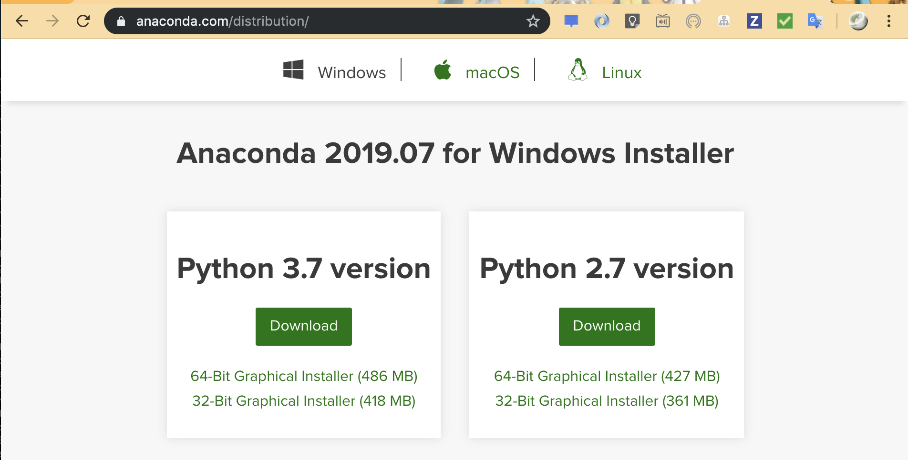

# Python インストール

といっても難しい話はありません。  
Python インタプリタを DL して周辺ライブラリをインストールして…は過去の話です。

環境構築もエンジニアのスキルではあるのでしょうが、それは運用環境とか作るアーキに任せましょう。  
Python をとりあえず入門するならやることはただ一つ

[Anaconda](https://www.anaconda.com/distribution/) をインストールすること。



*※ 本番運用だとかなりファットですが、ローカルで書き捨てのコードを書くには十分でしょう。*

ダウンロードしてイエスマンすれば基本的には完了です。  
環境変数設定もやってくれますので、苦労はないはず。

インストールが完了すればシェル上で

```sh
$ python
Python 3.7.4 (default, Aug 13 2019, 15:17:50)
[Clang 4.0.1 (tags/RELEASE_401/final)] :: Anaconda, Inc. on darwin
Type "help", "copyright", "credits" or "license" for more information.
>>>
```
これでインストールは完了です。