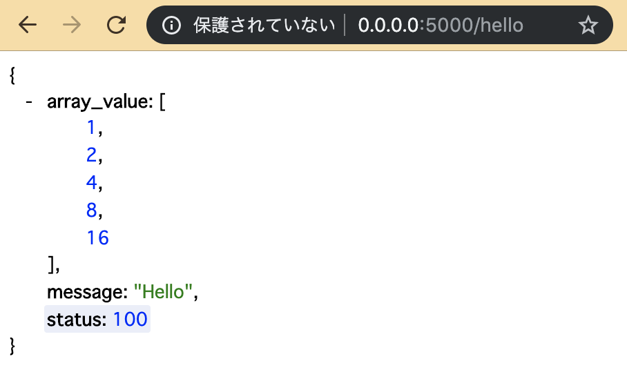

# REST サーバを数行で

for Python 3.7.x

第二言語として扱う場合は、主に外部連携サーバのテストとかで使います。

## Flask のインストール

Python 界隈でほぼデファクトな REST API フレームワークの Flask をインストールします。  
これも pip を使うだけです。

```bash
$ pip install flask
```

## REST サーバを数行で

`simple_rest.py` として用意しました。

```python
from flask import Flask, request, jsonify

app = Flask(__name__)

@app.route('/hello', methods=['GET', 'POST'])
def hello():
    respondData = {
        'message': 'Hello',
        'status': 100,
        'array_value': [1, 2, 4, 8, 16]
    }
    return jsonify(respondData)

if __name__ == '__main__':
    app.run(host='0.0.0.0', debug=True)
```

実行してみます。

```bash
$ python simple_rest.py 
 * Serving Flask app "simple_rest" (lazy loading)
 * Environment: production
   WARNING: This is a development server. Do not use it in a production deployment.
   Use a production WSGI server instead.
 * Debug mode: on
 * Running on http://0.0.0.0:5000/ (Press CTRL+C to quit)
 * Restarting with stat
 * Debugger is active!
 * Debugger PIN: 954-715-550
```

ブラウザでみてみると



